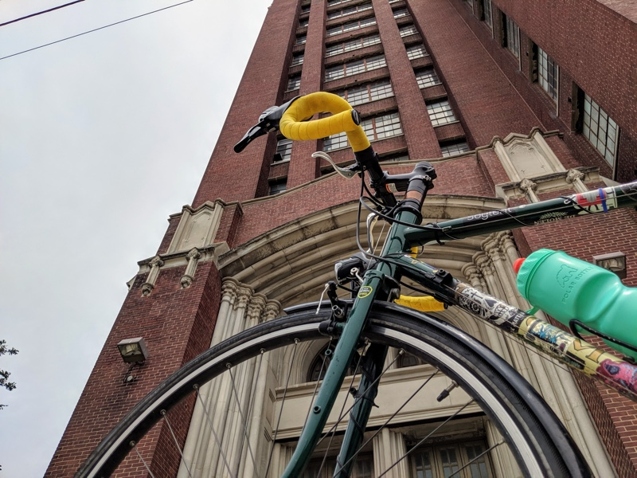
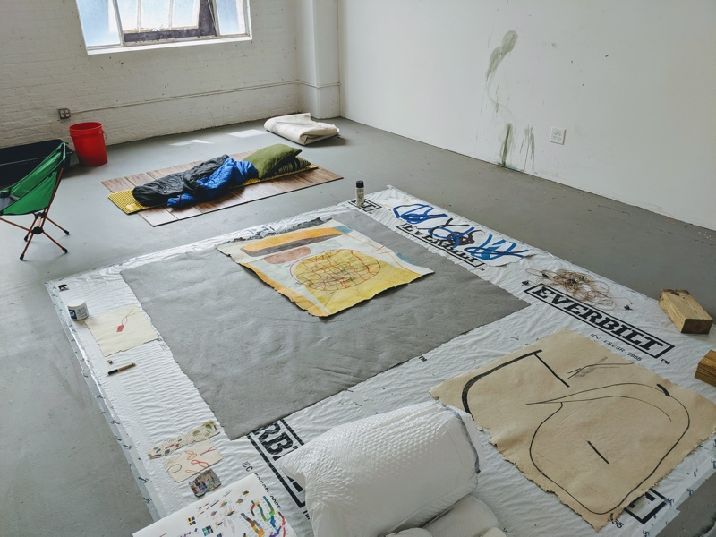

[Challenge](/blog/19/06/challenges/) #4 was given to me by my friend, Aya Nakamura (thanks Aya!):

> Ty should come to my studio and do a studio visit - who knows, it might inspire him!

The trip to Aya's studio was a ton of fun. It was the first sunny day in a while, and her studio is down in West Pilsen / Bridgeport. Focused bikeling [consistently centers me](/blog/19/06/kinds-of-forgiveness), and this ride was no exception. It prepared me to look at some art. And to eat tacos at El Milagro afterwards.

The studio itself is housed in a monolithic, red brick warehouse. Across the street were a dozen or so familiar food trucks parked outside what I assume are commercial kitchens. Aya met me at the front door, and I neglected to take photos but the entryway was a stark white befitting of studio space and a strong contrast against the building's industrial facade.

It's a cool building. Upstairs on the way to her studio, we walked through a few hallways whose warm-gray windowlessness encouraged passage, each studio hidden behind a slightly outsized door. Her studio itself had a wall full of windows and was bright (and was painted the same stark white). It was as serene as I imagine an indoor environment can be. It seems like a great place to create.

[Aya's art](https://www.aya-nakamura.com) is something to behold! We talked for a while about the space and her work, and there's no way I can really do it justice. Check it out [for yourself](https://www.aya-nakamura.com/2019). She makes her own paper (sometimes in three dimensions) and creates intuitive and beautiful drawings that explore the paper they're drawn on as an individual. And using only colored pencil! I was awestruck; the color is often so waxy and intense that it looks like oil pastel or acrylic.

I felt absorbed and calm looking at her work. Her compositions and colors are objectively beautiful, and each piece simultaneously guides your observation while offering branching, interconnected paths to observe and explore. I've been reading the book version of [How to Do Nothing](https://medium.com/@the_jennitaur/how-to-do-nothing-57e100f59bbb), and looking at Aya's art reminded me of Jenny Odell's description of spaces like the Rose Garden in San Francisco. How their labyrinthine, inward-looking architecture allows her to wholly engage her ability to listen, to observe the many facets of the world around her and be consumed by them, without distraction. Aya's art has a similar effect, they are Rose Gardens captured in paper and pigment.

<aside>
  <h6>Today's <a href="/blog/19/06/refining-questions/">Questions</a>:</h6>
  <ul>
    <li>Still wondering, how can I communicate my gratitude to each challenge-giver?</li>
    <li>How can I encourage people to adopt the word "bikeling" instead of (or in addition to) biking/cycling?
  </ul>
</aside>
