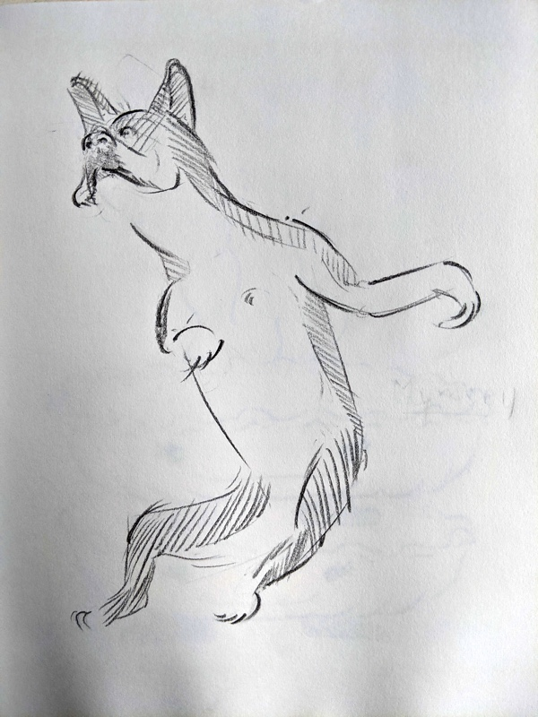
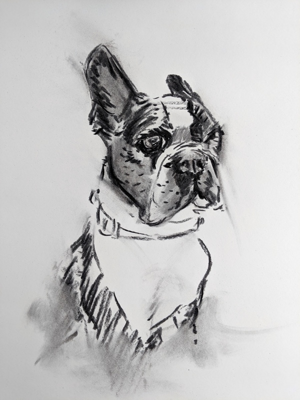

[Challenge](/blog/19/06/challenges/) #3 was given to me by my friend, Kim Swinehart (thanks Kim!) (alternate title, "The Mumsey-m"):

> Use any medium to create a piece of art in the likeness of Mumsey.

Mumsey is a dog. An adorable Boston Terrier. The first time we met was at a party at Kim's apartment. Kim opened the front door to reveal her now-husband Wes playing with Mumsey, who was dangling from a tug-of-war toy three feet in the air. Mumsey does not let go, ever. She is a fierce pup. If you're sitting down in the vicinity, she's also a cuddly lap dog.

The three of them now live out on a farm in Michigan, and I've never seen Mumsey so happy as when she's running around her new home. If I were to characterize Mumsey in a word, it would be "motion". She's _always_ moving; she may be part shark. Initally, I wanted to try to create an animation capturing our first meeting, but I don't have a strong enough grasp on dog anatomy (or animation) to make that happen (yet). Instead I made a single image. It may look more like an awkward [paso doble](https://www.youtube.com/watch?v=UUO5WPaIr-s#t=1m54s), but I had to try to represent Mumsey in-flight:

That drawing is on a sketchbook page and hard to hand someone. I wanted to make something on proper paper that I could give to Kim & Wes, so I also did a portrait on Mumsey in a medium and style I'm more comfortable with.

<aside>
  <h6>Today's <a href="/blog/19/06/refining-questions/">Questions</a>:</h6>
  <ul>
    <li>How can I show gratitude? To everyone who has given me a challenge?</li>
  </ul>
</aside>
