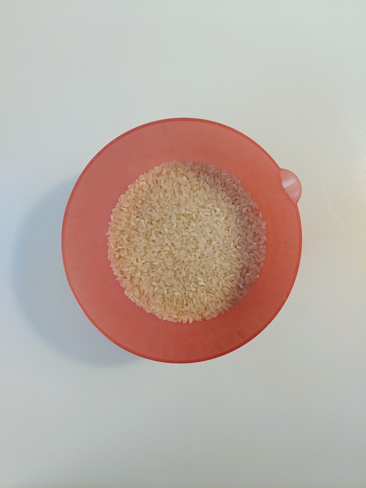
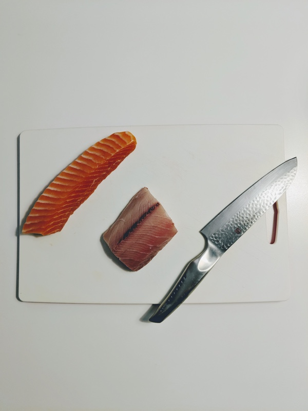
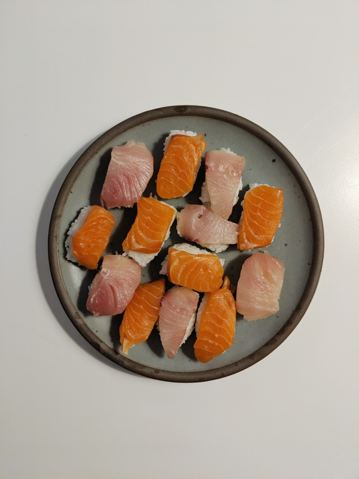
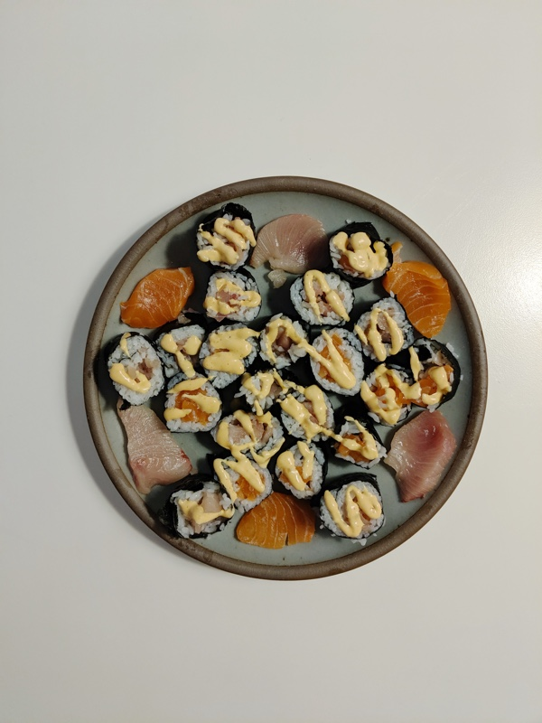

[Challenge](/blog/19/06/challenges/) #5 was given to me by my friend, Anna Brenner (thanks Anna!):

> Pick up sushi grade fish and learn how to make both nigiri and maki! And then eat it w/ some yummy sake.

This was a fun one. While the broad strokes of preparing sushi are readily apparent (I've made a lot of sushi in Overcooked 2), the details were a total mystery to me. I got a random, fortuitous text from my friend Jakub who had recently taken a sushi-making class and sent me over the class PDF. Maybe, that's cheating, but the point it to create more connections, right? The PDF left out some important details, anyways, so I had to do some extra digging (video tutorials) on my own.

I bikeled up to [Lawrence Fish Market](https://www.lawrencefish.com) for the fish, which I'd been to a few times before. The route was up and down Kedzie, which had been the hardest part [my ride to the Botanic Gardens](/blog/19/06/unintended-consequences), and I got to sub-in some of the thinking/reflection lost to hunger last time. The market itself has totally changed. It's now in the back of Bryn Mawr Fresh Market. Their shelves a little sparse, but I hope they're making it because the fish was and is great. The staff are were really friendly, too. A good spot to check out if you're looking for fresh fish.

Eventually I got to cooking. While preparing the rice, I learned that: sushi rice is mixed with rice vinegar, salt, and sugar ("sushi-zu"), chilling rice in cold water will both soften it and turn it opaque white, carving around the edge of the rice cooker's vessel with the paddle allows you to remove the entire mass of rice in a single turn, and it's important to handle the rice gently. It's important to handle the rice gently. You don't want to break it. It's important to handle the rice gently.

While preparing the fish I learned that: you typically slice against the grain to achieve many small layers of tender meat as opposed to one layer of potentially tough meat, you use a vinegar & water mixture ("tezu") to prevent your knife / fingers from getting too sticky, I have no idea how sushi chefs achieve such perfect cuts, and it's hard to eyeball the rice-to-fish ratio.

It's all harder than it looks: slicing the fish, forming the (right amount of) rice for the nigiri, creating a thin, even layer of rice for the maki, rolling out the maki. I should have watched more videos. I also made spicy mayo, but my makeshift piping bag didn't provide quite the level of control necessary. We ate it anyways. Everything was delicious, including the sake, and neither of us was particularly bothered by the imperfections.

<aside>
  <h6>Today's <a href="/blog/19/06/refining-questions/">Questions</a>:</h6>
  <ul>
    <li>Do I need to make up posts when I miss a day? What and to whom am I accountable?</li>
  </ul>
</aside>
